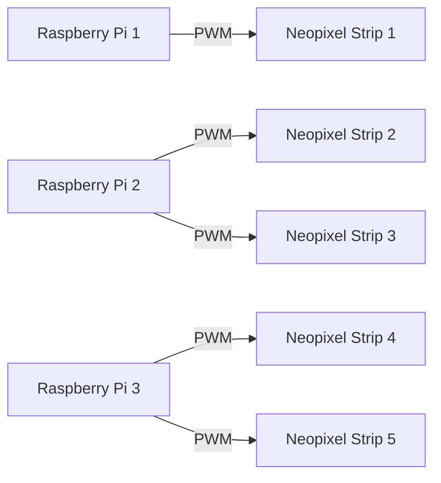

## 1. Hardware

1. Dupont cables <br>
<br> 


2. Raspberry Pi 4B x3 <br>
<br>

3. WS2812B Neopixel Strips <br>
<br>


## 2. Software
1. [Visual Studio Code](https://code.visualstudio.com/download)
2. [VNC Viewer](https://www.realvnc.com/en/connect/download/viewer/)
<br>
3. Raspbian Buster Full OS

## 3. Python Packages 
- rpi_WS281x 
* [I²C](https://docs.arduino.cc/learn/communication/wire/)

## 4. Neopixel Setup

<h3>
Step 1 : Installing the neccessary libraries for this project 
</h3>

```
pip install rpi_ws281x
```
<h3>
Step 2 : Enabling I2C and SPI on Pi 
</h3>

```
sudo raspi-config
select -> Interface Options 
select -> SPI (Enable)
select -> I2C (Enable)
```

<h3>
Step 3 : Connecting Neopixel strips to the Raspberry Pis
</h3>


<h3>
Step 4 : Configuring PWM pins ( to allow for multiple strips)
</h3>
Open up the terminal app and key in the following :

<br>

```
sudo nano /boot/config.txt
```
</br>

Use your arrow keys to scroll down and add this line at the bottom
```
dtoverlay=pwm-2chan
```

Next, save the file and reboot the Pi  :

To save the file, Ctrl O + Ctrl X
<br>

```
sudo reboot
```
</br>

<h3>
Step 5 : Testing of Neopixel strips with static white light
</h3>
<br>

```
from rpi_ws281x import *

# ───────── LED strip configuration ─────────
LED_COUNT_0 = 300       # Number of LED pixels on strip 0
LED_PIN_0 = 18          # GPIO pin for strip 0 (PWM)
LED_COUNT_1 = 300       # Number of LED pixels on strip 1
LED_PIN_1 = 13          # GPIO pin for strip 1 (PWM)

LED_FREQ_HZ = 800000    # LED signal frequency in hertz (usually 800kHz)
LED_DMA = 10            # DMA channel to use
LED_BRIGHTNESS = 255    # Brightness (0–255)
LED_INVERT = False      # Invert signal if needed

# ───────── Create NeoPixel objects ─────────
strip0 = Adafruit_NeoPixel(LED_COUNT_0, LED_PIN_0, LED_FREQ_HZ, LED_DMA, LED_INVERT, LED_BRIGHTNESS)
strip1 = Adafruit_NeoPixel(LED_COUNT_1, LED_PIN_1, LED_FREQ_HZ, LED_DMA, LED_INVERT, LED_BRIGHTNESS)

# Initialize both strips
strip0.begin()
strip1.begin()

# ───────── Functions ─────────
def setStaticWhite(strip, brightness=255):
    """Set all LEDs on a strip to static white color."""
    color = Color(brightness, brightness, brightness)  # White
    for i in range(strip.numPixels()):
        strip.setPixelColor(i, color)
    strip.show()

def turnOffLEDs(strip):
    """Turn off all LEDs on a strip."""
    for i in range(strip.numPixels()):
        strip.setPixelColor(i, Color(0, 0, 0))
    strip.show()

# ───────── Main ─────────
try:
    # Set both strips to static white
    setStaticWhite(strip0)
    setStaticWhite(strip1)

    while True:
        pass  # keep running so LEDs stay lit

except KeyboardInterrupt:
    # Turn off LEDs on both strips before exiting
    turnOffLEDs(strip0)
    turnOffLEDs(strip1)

```
</br>


## 5. System Diagram / Code Logic

- In the final sequence, we used a total of 3 Raspberry Pis and 5 neopixel strips to light up our rocket ship
<br></br>


<br></br>
- Raspberry Pi 1 will be running <a href="/Final Sequence-Neopixels/neopixel-fire.py">neopixel-fire.py</a> using GPIO 13 
- Raspberry Pi 2 will be running <a href="/Final Sequence-Neopixels/neopixel-flaps.py">neopixel-flaps.py</a> using GPIO 13 and 18
- Raspberry Pi 3 will be running <a href="/Final Sequence-Neopixels/neopixel-body.py">neopixel-body.py</a> using GPIO 13 and 18


