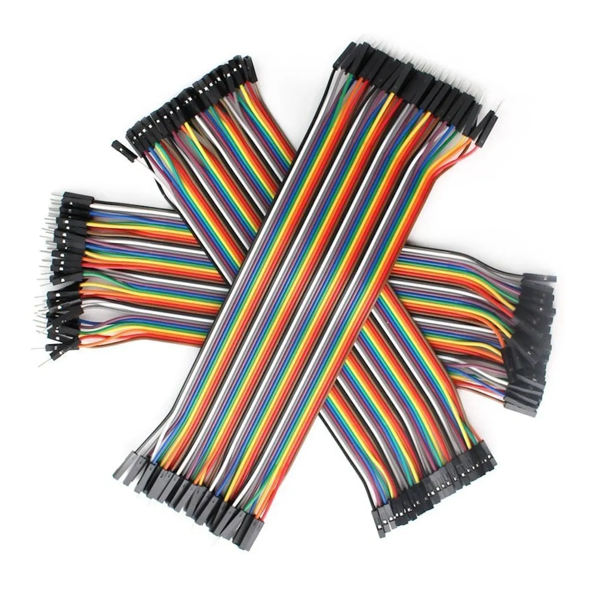
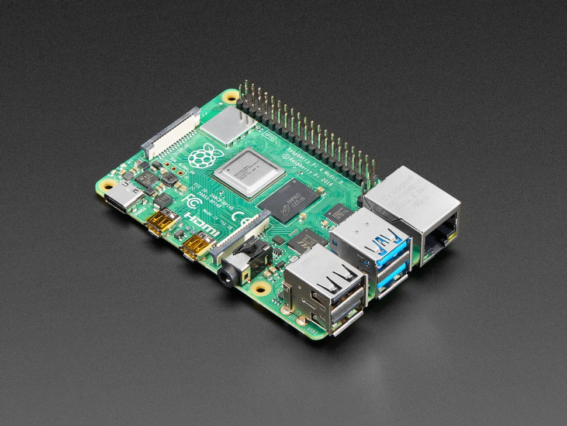
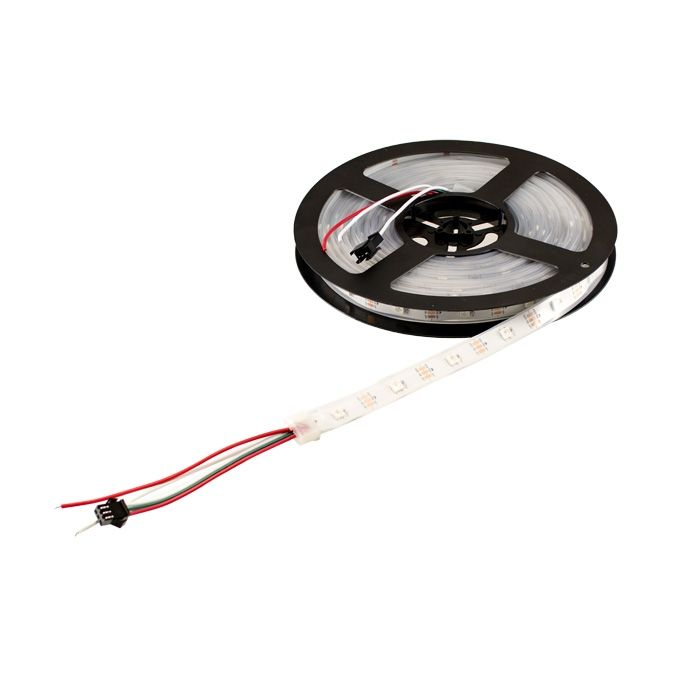
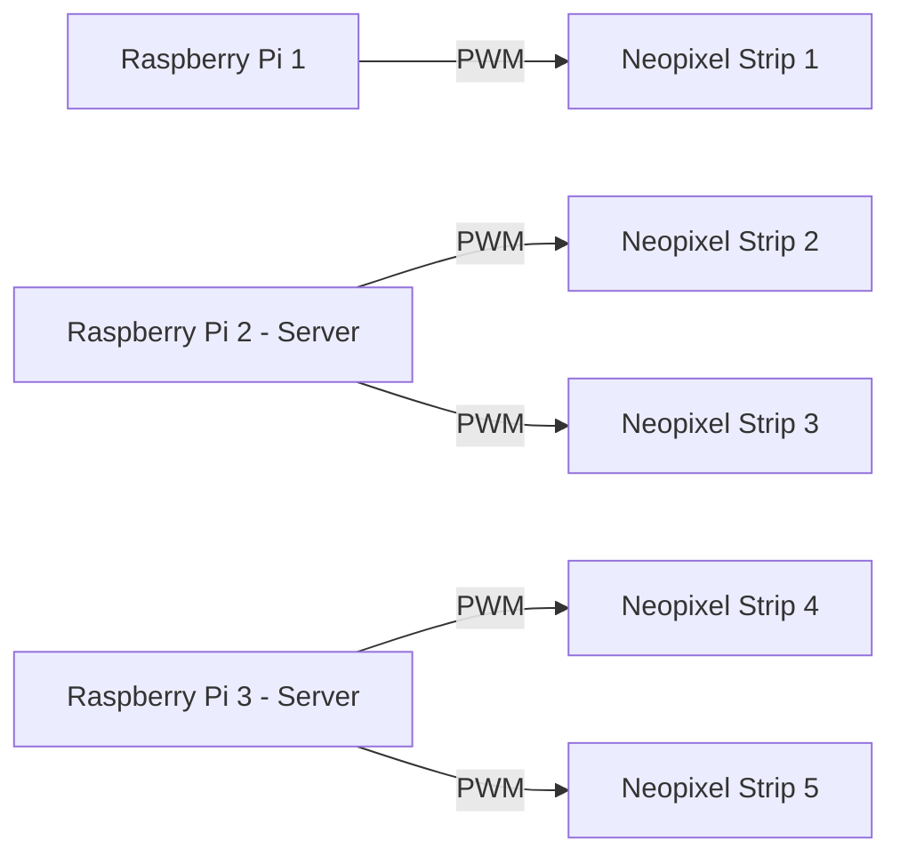

#  🏆 Final Sequence

As our Cadets face their final mission, *Sector 536* also reaches the end of its journey. That is when 5 of our Agents from 4 teams present to you the *Final Sequence. In this **Final Sequence**, you will witness a **Handmade Rocket** built entirely from cardboard, wrapped in glowing **NeoPixels**, brought to life with synchronized **lighting sequences** and **immersive audio**. Here are the different elements that brought our **Final Sequence** to life.

- 🚀 [Hardware - Handmade Rocket](https://github.com/Nixx-Goh/EGL314-Project-Lumen-Team-D/blob/6a936cd8a024c36ecc09ec25733163bec46a1fd3/Final%20Sequence/README.md)
- 💡 Neopixels
- ✨ [Lighting Sequences](https://github.com/YHLeong/EGL314_TeamC/tree/main/Final/Final%20lighting%20sequence/final%20lighting%20sequence.md)
- 🎶 [Immersive Audio + Button](https://github.com/Kean-en/TeamA-Egl314/tree/9e6a83c4c6c1ec6db7fd967705fbe311cad5f8f9/Code/Final%20Sequence/Final_button.md)

In this repository, we will be focusing on 💡*Neopixels*.


## 1. Hardware

1. Dupont cables <br>
<br> 


2. Raspberry Pi 4B x3 <br>
<br>

3. WS2812B Neopixel Strips <br>
<br>


## 2. Software
1. [Visual Studio Code](https://code.visualstudio.com/download)
2. [VNC Viewer](https://www.realvnc.com/en/connect/download/viewer/)
<br>
3. Raspbian Buster Full OS

## 3. Python Packages 
- rpi_WS281x 
* [I²C](https://docs.arduino.cc/learn/communication/wire/)
- Pythonosc

## 4. Neopixel Setup

<h3>
Step 1 : Installing the neccessary libraries for this project 
</h3>

```
pip install rpi_ws281x
```
<h3>
Step 2 : Enabling I2C and SPI on Pi 
</h3>

```
sudo raspi-config
select -> Interface Options 
select -> SPI (Enable)
select -> I2C (Enable)
```

<h3>
Step 3 : Connecting Neopixel strips to the Raspberry Pis
</h3>


<h3>
Step 4 : Configuring PWM pins ( to allow for multiple strips)
</h3>
Open up the terminal app and key in the following :

<br>

```
sudo nano /boot/config.txt
```
</br>

Use your arrow keys to scroll down and add this line at the bottom
```
dtoverlay=pwm-2chan
```

Next, save the file and reboot the Pi  :

To save the file, Ctrl O + Ctrl X
<br>

```
sudo reboot
```
</br>

<h3>
Step 5 : Testing of Neopixel strips with static white light
</h3>
<br>

```
from rpi_ws281x import *

# ───────── LED strip configuration ─────────
LED_COUNT_0 = 300       # Number of LED pixels on strip 0
LED_PIN_0 = 18          # GPIO pin for strip 0 (PWM)
LED_COUNT_1 = 300       # Number of LED pixels on strip 1
LED_PIN_1 = 13          # GPIO pin for strip 1 (PWM)

LED_FREQ_HZ = 800000    # LED signal frequency in hertz (usually 800kHz)
LED_DMA = 10            # DMA channel to use
LED_BRIGHTNESS = 255    # Brightness (0–255)
LED_INVERT = False      # Invert signal if needed

# ───────── Create NeoPixel objects ─────────
strip0 = Adafruit_NeoPixel(LED_COUNT_0, LED_PIN_0, LED_FREQ_HZ, LED_DMA, LED_INVERT, LED_BRIGHTNESS)
strip1 = Adafruit_NeoPixel(LED_COUNT_1, LED_PIN_1, LED_FREQ_HZ, LED_DMA, LED_INVERT, LED_BRIGHTNESS)

# Initialize both strips
strip0.begin()
strip1.begin()

# ───────── Functions ─────────
def setStaticWhite(strip, brightness=255):
    """Set all LEDs on a strip to static white color."""
    color = Color(brightness, brightness, brightness)  # White
    for i in range(strip.numPixels()):
        strip.setPixelColor(i, color)
    strip.show()

def turnOffLEDs(strip):
    """Turn off all LEDs on a strip."""
    for i in range(strip.numPixels()):
        strip.setPixelColor(i, Color(0, 0, 0))
    strip.show()

# ───────── Main ─────────
try:
    # Set both strips to static white
    setStaticWhite(strip0)
    setStaticWhite(strip1)

    while True:
        pass  # keep running so LEDs stay lit

except KeyboardInterrupt:
    # Turn off LEDs on both strips before exiting
    turnOffLEDs(strip0)
    turnOffLEDs(strip1)

```
</br>


## 5. System Diagram / Code Logic

- In the final sequence, we used a total of 3 Raspberry Pis and 5 neopixel strips to light up our rocket ship
<br></br>


<br></br>
- Raspberry Pi 1 will be running <a href="/Final Sequence-Neopixels/neopixel-fire.py">neopixel-fire.py</a> using GPIO 13 and this Pi will be running forever.
<br></br>
- Raspberry Pi 2 will be running <a href="/Final Sequence-Neopixels/neopixel-flaps.py">neopixel-flaps.py</a> using GPIO 13 and 18. It will also act as a server pi that will wait for the osc command before running the code
<br></br>
- Raspberry Pi 3 will be running <a href="/Final Sequence-Neopixels/neopixel-body.py">neopixel-body.py</a> using GPIO 13 and 18. It will also act as a server pi that will wait for the osc command before running the code

## 6. Receiving OSC commands to run the code
- In the final sequence, the Raspberry Pi 2 and 3 will act as server Pi's and wait for the /start osc command from a button press to run the codes. As seen in the code below.


``` 
def osc_start_handler(addr, *args):
    global start_show
    print("Received OSC /start")
    start_show = True

def start_osc_server(ip="192.168.254.51", port=2629):
    disp = dispatcher.Dispatcher()
    disp.map("/print", osc_start_handler)  # <-- Listening to /start OSC message
    server = osc_server.ThreadingOSCUDPServer((ip, port), disp)
    thread = threading.Thread(target=server.serve_forever)
    thread.daemon = True
    thread.start()
    print(f"OSC server running on {ip}:{port}")

# ───────── ENTRY POINT ─────────
if __name__ == "__main__":
    try:
        start_osc_server()  # Start the OSC server
        print("Waiting for OSC /start command...")

        while True:
            if start_show:
                run_dual_show_168()
                start_show = False  # Reset after show ends
                print("Show ended. Waiting for next OSC /start...")
            time.sleep(0.1)

    except KeyboardInterrupt:
        print("\nManual stop. Fading out...")
        fade_to_black(strip2)
        fade_to_black(strip3)
```

- The osc_start_handler function will set the value of start_show to TRUE once it receives the command from the client pi ( button pi).
<br>
- The start_osc_server function specifies the port and the IP of the server pi, which in this case would be the IP that the code is running from. 
<br>IP = 192.168.254.51  and Port = 2629.


- Below the 'Entry Point' section, running the code would start the osc server. When the Pi receives the /start osc command from the button press on the client Pi, the start_show variable will become TRUE which runs the whole show.

- After the neopixel show ends, the start_show variable will reset to FALSE which stops the show from running again unless another /start osc command is sent, which would run the show again.

- The osc setup is the same for the other Pi as well.

- Below shows the overall logic for the entire final sequence.


