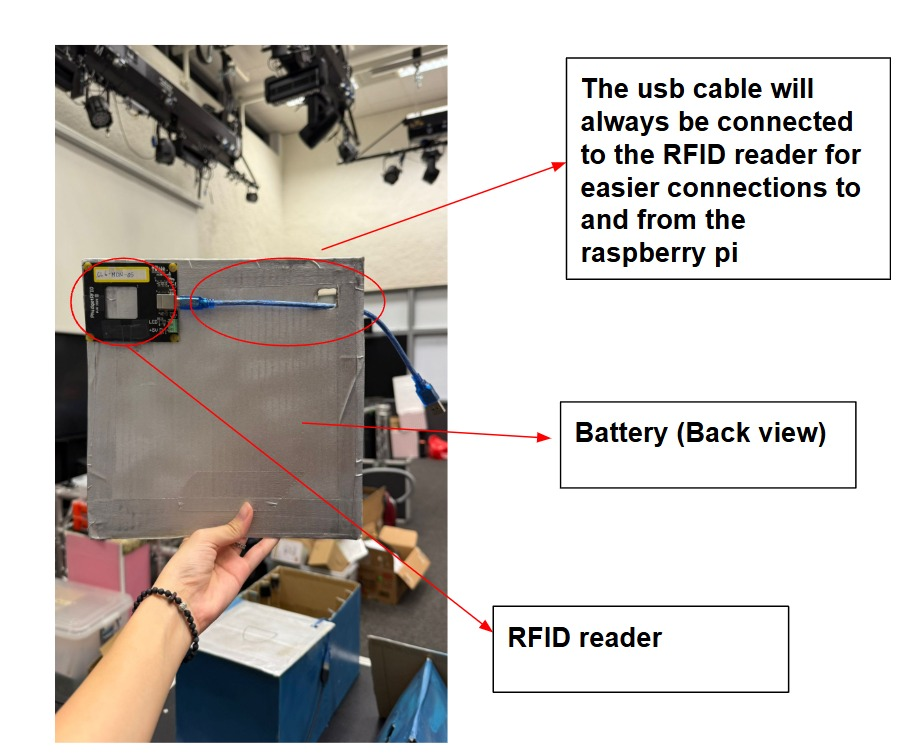
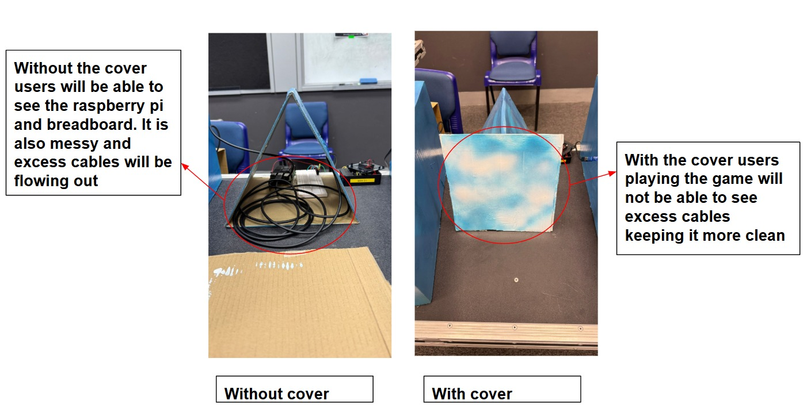

<h1>
Hardware setup for RFID readers and ultrasonic sensors
</h1>

<h2>
System Flowchart
</h2>

------

<h2>
Hardware used
</h2>

* [HC-SR04 Ultrasonic sensor x4](https://projecthub.arduino.cc/Isaac100/getting-started-with-the-hc-sr04-ultrasonic-sensor-7cabe1)
* Large LED Arcade Button
* [Raspberry PI model 4b x3](https://www.raspberrypi.com/products/raspberry-pi-4-model-b/)
* [Phidgets 1023 RFID reader x4](https://www.raspberrypi.com/products/raspberry-pi-4-model-b/)
* RFID Tags

<h2>
Explanations for battery pack setup
</h2>

 
 

<h2>
Explanations for battery setup
</h2>

 
 

<h2>
Explanations for cable management
</h2>

