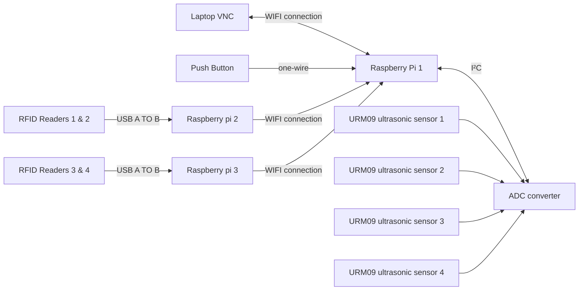
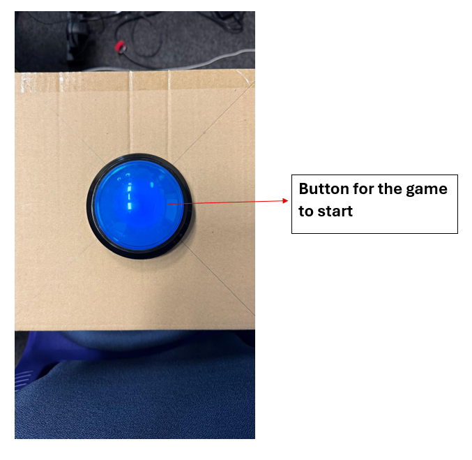
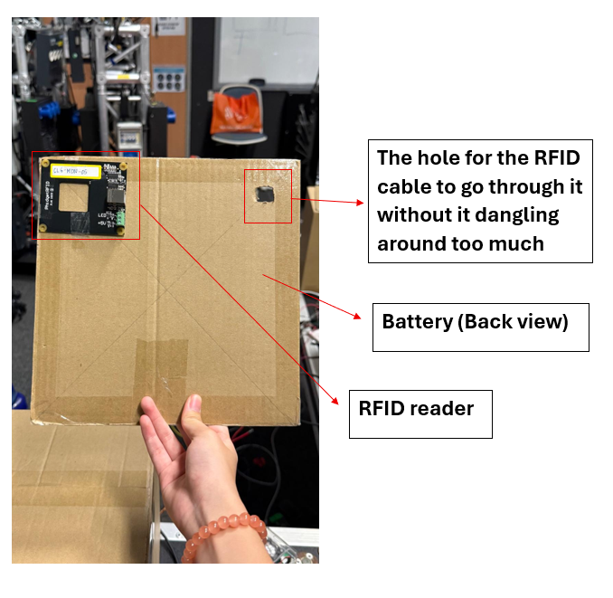
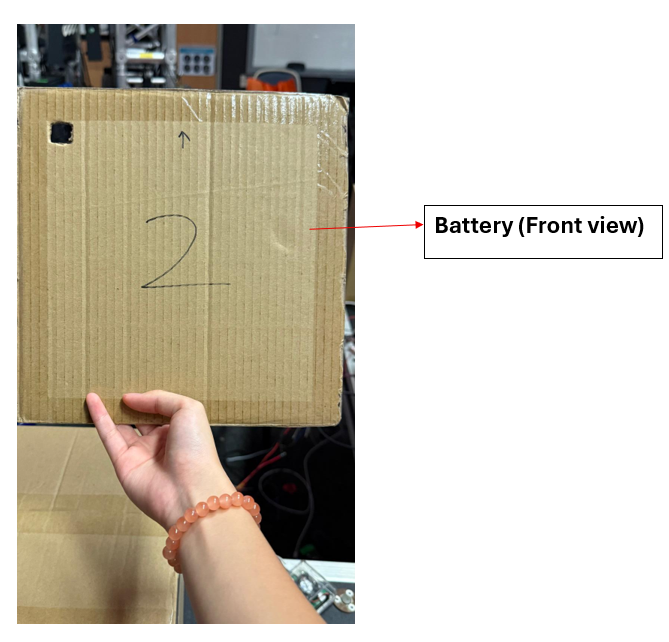

<h1>
Hardware setup for RFID readers and ultrasonic sensors
</h1>

<h2>
System Flowchart
</h2>

------

<h2>
Hardware used
</h2>

* 3 Raspberry Pis 
* 4 URM09 ultrasonic sensor
* 1 Push button
* 4 RFID readers
* 16 RFID tags
* 1 ADC converter

<h2>
Explanations for battery pack setup
</h2>

 
 

<h2>
Explanations for battery setup
</h2>

 
 

<h2>
Explanations for cable management
</h2>

