<h1>
Hardware setup for RFID readers and ultrasonic sensors
</h1>

<h2>
System Flowchart

```mermaid
graph LR

A[Laptop VNC] <--WIFI connection-->B[Raspberry Pi 1]<--I²C-->C[ADC converter]
D[URM09 ultrasonic sensor 1]-->C
E[URM09 ultrasonic sensor 2]-->C
F[URM09 ultrasonic sensor 3]-->C
G[URM09 ultrasonic sensor 4]-->C
H[Push Button]-- one-wire -->B
K[RFID Readers 1 & 2]--USB A TO B -->J[Raspberry pi 2]
M[RFID Readers 3 & 4]--USB A TO B-->L[Raspberry pi 3]
J[Raspberry pi 2]--WIFI connection-->B[Raspberry Pi 1]
L[Raspberry pi 3]--WIFI connection-->B[Raspberry Pi 1]


```

</h2>

------

<h2>
Hardware used
</h2>

* [URM09 Ultrasonic sensors x4](https://www.mouser.com/pdfDocs/Product-Overview-DFRobot-Gravity-URM09-Ultrasonic-Sensor.pdf?srsltid=AfmBOor5n3oFKTlsq1VN-juzz-UtqUuADQH-_8GNkdAGD2FyU22y8_pA)
* [ADS1115 x1](https://esphome.io/components/sensor/ads1115.html)
* Large LED Arcade Button
* [Raspberry PI model 4b x4](https://www.raspberrypi.com/products/raspberry-pi-4-model-b/)
* [Phidgets 1023 RFID reader x4](https://www.raspberrypi.com/products/raspberry-pi-4-model-b/)
* RFID Tags

<h2>
Explanations for battery pack setup
</h2>

 
 

<h2>
Explanations for battery setup
</h2>

 
 

<h2>
Explanations for cable management
</h2>

