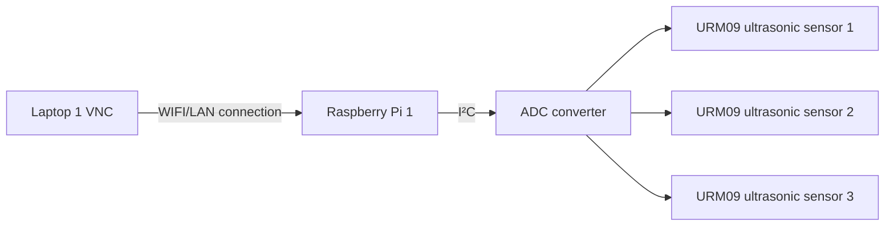
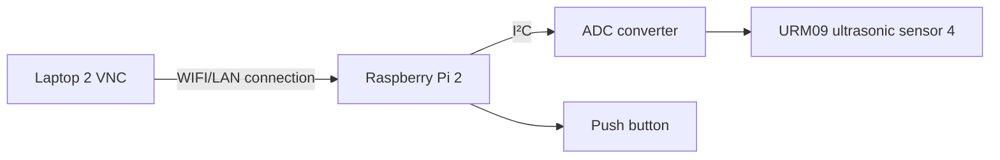

<h1 align="center">
    EGL314_TEAMB Overview
</h1>

Project <b>L.U.M.E.N</b> is an experiential / exploratory initiative that invites you to re-awaken the “Temple of Lumen” using modern audio visual technology.

-------------------------------

# Team members

1. Tim
2. Priscilla
3. Phyllis
4. Marcus

# System Diagram 1 (3 Ultrasonic Sensors)


# System Diagram 2 (1 Ultrasonic Sensor + 1 Push Button)



# Dependencies
The codes had been made using **Python 3.9 or higher**

**Software:**
* [Visual Studio Code](https://code.visualstudio.com/download)
* [VNC Viewer](https://www.realvnc.com/en/connect/download/viewer/)


**Hardware**
* [adafruit_ads1x15.ads1115](https://docs.circuitpython.org/projects/ads1x15/en/latest/)
* [I²C](https://docs.arduino.cc/learn/communication/wire/)
* [URM09 Ultrasonic sensors x4](https://www.mouser.com/pdfDocs/Product-Overview-DFRobot-Gravity-URM09-Ultrasonic-Sensor.pdf?srsltid=AfmBOor5n3oFKTlsq1VN-juzz-UtqUuADQH-_8GNkdAGD2FyU22y8_pA)
* [ADS1115 x2](https://esphome.io/components/sensor/ads1115.html)
* Buttons
* [Raspberry PI model 4b x4](https://www.raspberrypi.com/products/raspberry-pi-4-model-b/)
* [GPIO](https://projects.raspberrypi.org/en/projects/physical-computing/1)
<br><br>
# Code Logic

## Key Logic Steps
* Initialize the ADS1115 ADC (I²C communication).

* Set up a GPIO button (with software debouncing).

* Wait for button press to trigger a sensor reading.

* Read the analog voltage from the URM09 sensor.

* Convert the ADC value to voltage (0-3.3V or 0-5V).

* Map voltage to distance (URM09 outputs ~10mV/cm by default).

* Display or log the distance in centimeters.

## Step 1: Prepping Raspberry pi
**[Huats Club - rpistarterkit](https://github.com/huats-club/rpistarterkit)**

## Step 2: Enable I²C on Raspberry Pi
1. Open the terminal and run:

```
sudo raspi-config
```
2. Navigate to Interfacing Options → I²C → Enable.
3. Reboot the Pi:
```
sudo reboot
```
4. Verify I²C is working:
```
sudo I²Cdetect -y 1
```
(You should see the ADS1115 address, typically 0x48).

## Step 3: Install Required Libraries
1. Update packages:
```
sudo apt update && sudo apt upgrade -y
```
2. Install Python libraries (Ultrasonic Sensors):
```
sudo apt install python3-pip
pip3 install adafruit-ads1x15
```
3. Install Python libraries (Button)
```
sudo apt install python3-rpi.gpio
```
The Raspberry Pi OS already includes GPIO support, but you may need to install RPi.GPIO (if not present)

## Step 4: Write a Python Script (Ultrasonic Sensors)
1. Initialization Phase
```
import board
import busio
import adafruit_ads1x15.ads1115 as ADS
from adafruit_ads1x15.analog_in import AnalogIn
import time
```
2. I²C Setup & ADC Configuration
```
I²C = busio.I²C(board.SCL, board.SDA)  # Initialize I²C bus
ads = ADS.ADS1115(I²C)                  # Create ADS1115 object
ads.gain = 1                            # Set gain (±4.096V range)
```
* I²C Bus: Uses default GPIO pins (SCL=GPIO3, SDA=GPIO2).

* ADS1115 Settings:
    * Gain 1 means the ADC measures voltages between 0-4.096V (ideal for URM09's 0.3V–2.8V output).
3. Sensor Channel Setup
```
chan0 = AnalogIn(ads, ADS.P0)  # A0
chan1 = AnalogIn(ads, ADS.P1)  # A1
chan2 = AnalogIn(ads, ADS.P2)  # A2
```
* Analog Channels:
    * Three URM09 sensors connected to A0, A1, A2 of the ADS1115.
    * Each AnalogIn object reads voltage from its respective pin.
4. Voltage Reading Function
```
def get_voltage(sensor_num=2):  # Defaults to A2 (chan2)
    if sensor_num == 0:
        return chan0.voltage
    elif sensor_num == 1:
        return chan1.voltage
    elif sensor_num == 2:
        return chan2.voltage
    else:
        return 0.0  # Fallback for invalid sensor numbers
```
* Logic:
    * Takes a sensor_num argument (0, 1, or 2) to select which sensor to read.
    * Returns the voltage value from the specified sensor (or 0.0 for invalid inputs).
    * Defaults to A2 (Sensor 3) if no argument is passed.
5. Distance Conversion
```
def analog_to_distance(voltage):
    return voltage * 100  # Rough estimate (calibrate this!)
```
* Formula:
    * Placeholder linear conversion: Assumes 1V = 100cm.
    * Converts raw voltages to distance estimates
6. Distance Quantization
```
def quantize_distance(distance):
    if 1 <= distance < 15:
        return 10
    elif 15 <= distance < 25:
        return 20
    elif 25 <= distance < 35:
        return 30
    elif 35 <= distance < 45:
        return 40
    else:
        return distance
```
* Simplifies noisy sensor data into clean, standardized values.
* Processes all channels independently
7. Main Loop
```
while True:
    # Read all 3 sensors
    voltage0 = get_voltage(0)  # A0
    voltage1 = get_voltage(1)  # A1
    voltage2 = get_voltage(2)  # A2

    # Convert voltages to distances
    distance0 = analog_to_distance(voltage0)
    distance1 = analog_to_distance(voltage1)
    distance2 = analog_to_distance(voltage2)

     # Quantize distances
    quantized0 = quantize_distance(distance0)
    quantized1 = quantize_distance(distance1)
    quantized2 = quantize_distance(distance2)

    print(f"Sensor 1: {quantized0:.1f} cm | Sensor 2: {quantized1:.1f} cm | Sensor 3: {quantized2:.1f} cm")
    time.sleep(0.5)  # Delay to avoid flooding the console
```
* Workflow:
    * Reads voltages from all 3 sensors using get_voltage().
    * Converts voltages to distances using analog_to_distance().
    * Applies quantization to each distance reading
    * Prints distances in a formatted string.
    * Waits 0.5 seconds before repeating.
## Step 5: Write a Python Script (Button)
1. Import Libraries
```
import RPi.GPIO as GPIO
import time
```
* GPIO: Controls Raspberry Pi's GPIO pins.
* time: Adds delays (prevents CPU overuse).
2. GPIO Setup
```
button_pin = 26  # Using GPIO26 (BCM numbering)
GPIO.setmode(GPIO.BCM)  # Use Broadcom (BCM) pin numbers
GPIO.setup(button_pin, GPIO.IN, pull_up_down=GPIO.PUD_UP)
```
* Button Connection:

    * Connected between GPIO26 and GND (internal pull-up enabled).
    * Pressing the button pulls the pin to LOW (0V).
* Pull-Up Resistor:
    * Internally activates to keep the pin HIGH (3.3V) when the button is not pressed.
3. Toggle Variable
```
toggle = 0  # Initial state (0 or 1)
```
* Stores the toggle state (0 = off, 1 = on).
4. Callback Function
```
def button_callback(channel):
    global toggle
    toggle = 1 - toggle  # Flips 0→1 or 1→0
    print("Button pressed! Toggle value:", toggle)
```
* Trigger: Called when the button is pressed (detects FALLING edge).
* Action:
    * Toggles toggle between 0 and 1.
    * Prints the new state.
5. Interrupt Setup
```
GPIO.add_event_detect(button_pin, GPIO.FALLING, callback=button_callback, bouncetime=300)
```
* Event Detection:
    * Listens for FALLING edge (button press pulls pin from HIGH to LOW).
* Debouncing:
    * bouncetime=300ms ignores additional presses for 300ms to avoid false triggers.
6. Main Loop
```
try:
    print("Press the button")
    while True:
        time.sleep(0.1)  # Keeps the program running
except KeyboardInterrupt:
    GPIO.cleanup()  # Clean up GPIO on CTRL+C
GPIO.cleanup()  # Clean up on normal exit
```
* Purpose:
    * Keeps the script running while waiting for button presses.
    * Sleeps briefly (0.1s) to reduce CPU usage.
* Cleanup:
    * Resets GPIO pins on exit (prevents hardware issues).

