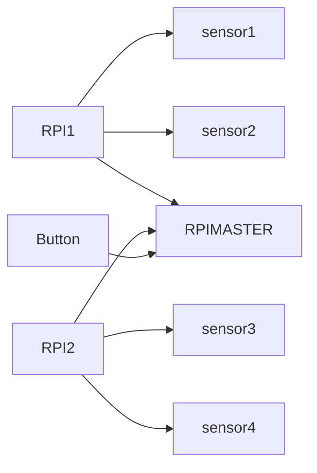

# EGL314_TEAMB Overview

Hello! We are Team B and we are creating a game for our school project "L.U.M.E.N"
Project L.U.M.E.N is an experiential / exploratory initiative that invites you to re-awaken the “Temple of Lumen” using modern audio visual technology.

-------------------------------

# Team members

1. Tim
2. Priscilla
3. Phyllis
4. Marcus

# Flowchart

# Dependencies
The codes had been made using **Python 3.9 or higher**

**Software:**

* [I2C](https://docs.arduino.cc/learn/communication/wire/)
* [adafruit_ads1x15.ads1115](https://docs.circuitpython.org/projects/ads1x15/en/latest/)
* [GPIO](https://projects.raspberrypi.org/en/projects/physical-computing/1)

**Hardware**
* [URM09 Ultrasonic sensors x4](https://www.mouser.com/pdfDocs/Product-Overview-DFRobot-Gravity-URM09-Ultrasonic-Sensor.pdf?srsltid=AfmBOor5n3oFKTlsq1VN-juzz-UtqUuADQH-_8GNkdAGD2FyU22y8_pA)
* [ADS1115 x2](https://esphome.io/components/sensor/ads1115.html)
* Buttons
* [Raspberry PI model 3b x4](https://www.raspberrypi.com/products/raspberry-pi-3-model-b/)

