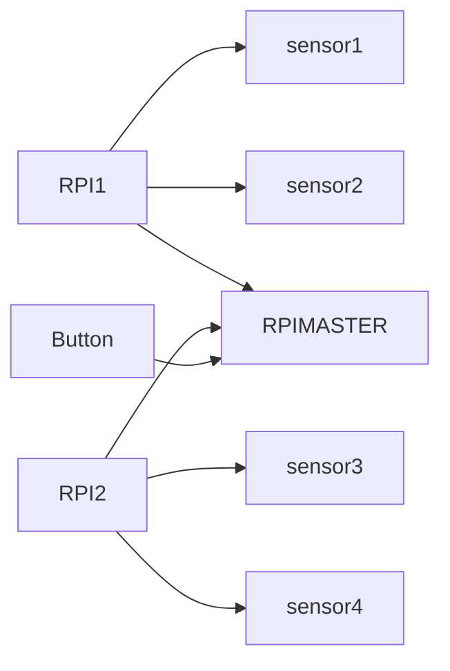

# EGL314_TEAMB Overview

Hello! We are Team B and we are creating a game for our school project "L.U.M.E.N"
Project L.U.M.E.N is an experiential / exploratory initiative that invites you to re-awaken the “Temple of Lumen” using modern audio visual technology.

-------------------------------

# Team members

1. Tim
2. Priscilla
3. Phyllis
4. Marcus

# Flowchart

# Dependencies
The codes had been made using **Python 3.9 or higher**

**Software:**

* I2C
* adafruit_ads1x15.ads1115
* GPIO

**Hardware**
* URM09 Ultrasonic sensors x4
* ADS1115 x2
* Buttons
* Raspberry PI model 3b x4

