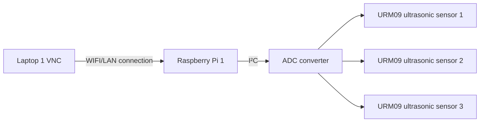
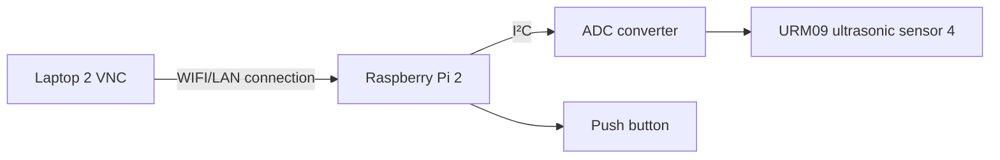

<h1 align="center">
    EGL314_TEAMB Overview
</h1>

Hello! We are Team B and we are creating a game for our school project "L.U.M.E.N"
Project L.U.M.E.N is an experiential / exploratory initiative that invites you to re-awaken the “Temple of Lumen” using modern audio visual technology.

-------------------------------

# Team members

1. Tim
2. Priscilla
3. Phyllis
4. Marcus

# System Diagram 1 (3 Ultrasonic Sensors)


# System Diagram 2 (1 Ultrasonic Sensor + 1 Push Button)



# Dependencies
The codes had been made using **Python 3.9 or higher**

**Software:**

* <a href="https://docs.arduino.cc/learn/communication/wire/" target="_blank" rel="noopener noreferrer">I²C</a>
* <a href="https://docs.circuitpython.org/projects/ads1x15/en/latest/" target="_blank" rel="noopener noreferrer">adafruit_ads1x15.ads1115</a>
* <a href="https://projects.raspberrypi.org/en/projects/physical-computing/1" target="_blank" rel="noopener noreferrer">GPIO</a>

**Hardware**
* <a href="https://www.mouser.com/pdfDocs/Product-Overview-DFRobot-Gravity-URM09-Ultrasonic-Sensor.pdf?srsltid=AfmBOor5n3oFKTlsq1VN-juzz-UtqUuADQH-_8GNkdAGD2FyU22y8_pA" target="_blank" rel="noopener noreferrer">URM09 Ultrasonic sensors x4</a>
* <a href="https://esphome.io/components/sensor/ads1115.html" target="_blank" rel="noopener noreferrer">ADS1115 x2</a>
* Buttons
* <a href="https://www.raspberrypi.com/products/raspberry-pi-4-model-b/" target="_blank" rel="noopener noreferrer">Raspberry PI model 4b x4</a>
<br><br>
# Code Logic

## Key Logic Steps
* Initialize the ADS1115 ADC (I2C communication).

* Set up a GPIO button (with software debouncing).

* Wait for button press to trigger a sensor reading.

* Read the analog voltage from the URM09 sensor.

* Convert the ADC value to voltage (0-3.3V or 0-5V).

* Map voltage to distance (URM09 outputs ~10mV/cm by default).

* Display or log the distance in centimeters.

## Step 1: Prepping Raspberry pi
**[Huats Club - rpistarterkit](https://github.com/huats-club/rpistarterkit)**

## Step 2: Enable I2C on Raspberry Pi
1. Open the terminal and run:

```
sudo raspi-config
```
2. Navigate to Interfacing Options → I2C → Enable.
3. Reboot the Pi:
```
sudo reboot
```
4. Verify I2C is working:
```
sudo i2cdetect -y 1
```
(You should see the ADS1115 address, typically 0x48).

## Step 3: Install Required Libraries
1. Update packages:
```
sudo apt update && sudo apt upgrade -y
```
2. Install Python libraries (Ultrasonic Sensors):
```
sudo apt install python3-pip
pip3 install adafruit-ads1x15
```
3. Install Python libraries (Button)
```
sudo apt install python3-rpi.gpio
```
The Raspberry Pi OS already includes GPIO support, but you may need to install RPi.GPIO (if not present)