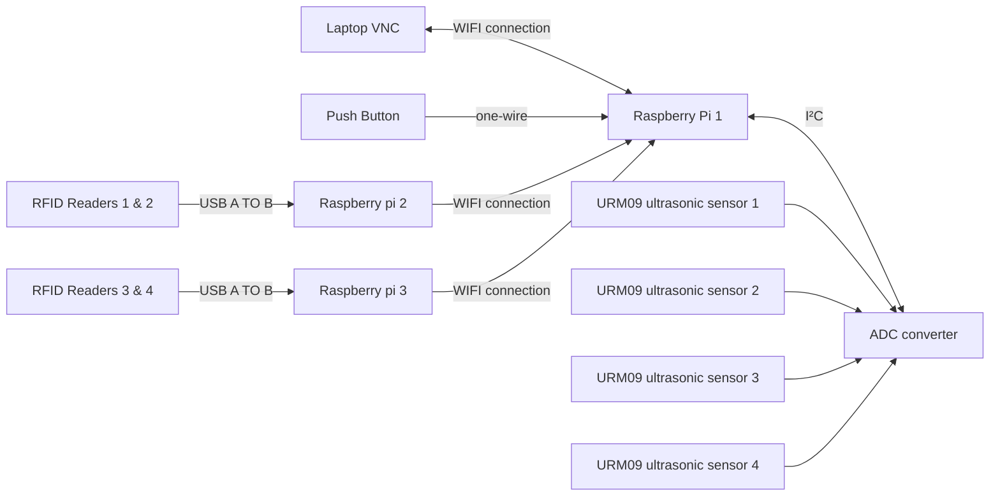
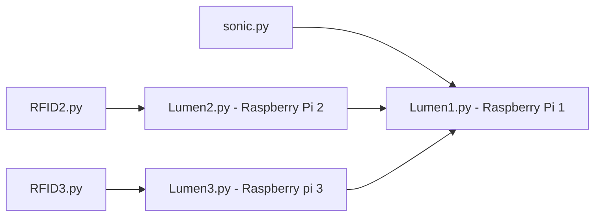

<h1 align="center">
    EGL314_TEAM B Overview
</h1>
<h2 align = "center">
  Team Members:<br><br>
  <a href="https://github.com/timsjt"></a>
  <a href="https://github.com/marcuslolop"></a>
  <a href="https://github.com/prisstann"></a>
  <a href="https://github.com/PhyllisChew"></a>
  <br>
  <br>

</h2>

Project **L.U.M.E.N** takes place in Sector 536 - A cosmic frontier within NYP , named after the classroom where it all began. This project is inspired by Singapore's growing investment in space research and technology. Sector 536 invites guests to explore a series of immersive space stationed at the edge of the unknown, these are the 4 exhibits :

Station 1 - Laser Defence Protocol
Station 2 - Kinetic Core Recharge
Station 3 - Chromatic Defence Simulator
Station 4 - Launch Core Override

In this Repository , we will be focusing strictly on **Station 4 - Launch Core Override**

-------------------------------

# Station 4 - Launch Core Override
In this station , there are 4 'Battery Packs' which require the players to fill up using the energy packs obtained from the first station. 

The 'Battery Packs' , contains 4 slots in which the players have to figure out the correct sequence and position to slot the fully charged energy packs into. The players will also have to use their critical thinking skills to guess the correct sequence as each energy pack has their specific battery pack that needs to be slotted into.   

-------------------------------


# System Diagram 




# Dependencies
The codes had been made using **Python 3.9 or higher**

**Hardware**
* [URM09 Ultrasonic sensors x4](https://www.mouser.com/pdfDocs/Product-Overview-DFRobot-Gravity-URM09-Ultrasonic-Sensor.pdf?srsltid=AfmBOor5n3oFKTlsq1VN-juzz-UtqUuADQH-_8GNkdAGD2FyU22y8_pA)
* [ADS1115 x1](https://esphome.io/components/sensor/ads1115.html)
* Large LED Arcade Button
* [Raspberry PI model 4b x4](https://www.raspberrypi.com/products/raspberry-pi-4-model-b/)
* [Phidgets 1023 RFID reader x4](https://www.raspberrypi.com/products/raspberry-pi-4-model-b/)
* RFID Tags

**Software:**
* [Visual Studio Code](https://code.visualstudio.com/download)
* [VNC Viewer](https://www.realvnc.com/en/connect/download/viewer/)

**Python Package**
* [I²C](https://docs.arduino.cc/learn/communication/wire/)
* [RPI](https://projects.raspberrypi.org/en/projects/physical-computing/1)
* [adafruit_ads1x15.ads1115](https://docs.circuitpython.org/projects/ads1x15/en/latest/)
* [Phidgets 22 library](https://pypi.org/project/phidget22/#files)
<br></br>
 # Code Logic


<br>
<b>Raspberry Pi 1 [ main pi ]</b> <br>
<br>
Lumen1.py contains the code for the main game logic and is responsible for starting the server used for communication between the 2 Pis
<br><br>
Sonic.py handles the data received by 4 ultrasonic sensors + 1 push button
<br>

<br><br>
<b>Raspberry Pi 2 [ Secondary Pi for RFID readers 1 & 2 ]</b><br><br>
Lumen2.py connects Rasp Pi 2 to 1 via TCP/IP Socket/Server and is responsible for sending RFID data to Pi 1
<br><br>
RFID2.py handles the data received by RFID readers 1 and 2
<br><br>
<b>Raspberry Pi 3 [ Third Pi for RFID readers 3 & 4 ]</b><br><br>
Lumen3.py connects Rasp Pi 3 to 1 via TCP/IP Socket/Server and is responsible for sending RFID data to Pi 1
<br><br>
RFID3.py handles the data received by RFID readers 3 and 4


## Step 1: Prepping Raspberry pi
**[Huats Club - rpistarterkit](https://github.com/huats-club/rpistarterkit)**

## Step 2: Enable I²C on Raspberry Pi
<h3>
1. Open the terminal and run:
</h3>

```
sudo raspi-config
```
<h3>
2. Navigate to Interfacing Options → I²C → Enable
</h3>

<h3>
3. Reboot the Pi:
</h3>

```
sudo reboot
```
<h3>
4. Verify I²C is working:
</h3>


```
sudo I²Cdetect -y 1
```
(You should see the ADS1115 address, typically 0x48).

## Step 3: Install Required 
<h3>
1. Update packages:
</h3>

```
sudo apt update && sudo apt upgrade -y
```

<h3>
2. Install Python libraries (Ultrasonic Sensors):
</h3>

```
sudo apt install python3-pip
pip3 install adafruit-ads1x15
```
<h3>
3. Install Python libraries (Button)
</h3>

```
sudo apt install python3-rpi.gpio
```
The Raspberry Pi OS already includes GPIO support, but you may need to install RPi.GPIO (if not present)

## Step 4: Write a Python Script (Ultrasonic Sensors)
<h3>
1. Initialization Phase
</h3>

```
import board
import busio
import adafruit_ads1x15.ads1115 as ADS
from adafruit_ads1x15.analog_in import AnalogIn
import time
```
<h3>
2. I²C Setup & ADC Configuration
</h3>

```
I²C = busio.I²C(board.SCL, board.SDA)  # Initialize I²C bus
ads = ADS.ADS1115(I²C)                  # Create ADS1115 object
ads.gain = 1                            # Set gain (±4.096V range)
```
* I²C Bus: Uses default GPIO pins (SCL=GPIO3, SDA=GPIO2).

* ADS1115 Settings:
    * Gain 1 means the ADC measures voltages between 0-4.096V (ideal for URM09's 0.3V–2.8V output).

<h3>
3. Sensor Channel Setup
</h3>

```
chan0 = AnalogIn(ads, ADS.P0)  # A0
chan1 = AnalogIn(ads, ADS.P1)  # A1
chan2 = AnalogIn(ads, ADS.P2)  # A2
```
* Analog Channels:
    * Three URM09 sensors connected to A0, A1, A2 of the ADS1115.
    * Each AnalogIn object reads voltage from its respective pin.

<h3>
4. Voltage Reading Function
</h3>

```
def get_voltage(sensor_num=2):  # Defaults to A2 (chan2)
    if sensor_num == 0:
        return chan0.voltage
    elif sensor_num == 1:
        return chan1.voltage
    elif sensor_num == 2:
        return chan2.voltage
    else:
        return 0.0  # Fallback for invalid sensor numbers
```
* Logic:
    * Takes a sensor_num argument (0, 1, or 2) to select which sensor to read.
    * Returns the voltage value from the specified sensor (or 0.0 for invalid inputs).
    * Defaults to A2 (Sensor 3) if no argument is passed.

<h3>
5. Distance Conversion
</h3>

```
def analog_to_distance(voltage):
    return voltage * 100  # Rough estimate (calibrate this!)
```
* Formula:
    * Placeholder linear conversion: Assumes 1V = 100cm.
    * Converts raw voltages to distance estimates

<h3>
6. Distance Quantization
</h3>

```
def quantize_distance(distance):
    if 1 <= distance < 15:
        return 10
    elif 15 <= distance < 25:
        return 20
    elif 25 <= distance < 35:
        return 30
    elif 35 <= distance < 45:
        return 40
    else:
        return distance
```
* Simplifies noisy sensor data into clean, standardized values.
* Processes all channels independently

<h3>
7. Main Loop
</h3>

```
while True:
    # Read all 3 sensors
    voltage0 = get_voltage(0)  # A0
    voltage1 = get_voltage(1)  # A1
    voltage2 = get_voltage(2)  # A2

    # Convert voltages to distances
    distance0 = analog_to_distance(voltage0)
    distance1 = analog_to_distance(voltage1)
    distance2 = analog_to_distance(voltage2)

     # Quantize distances
    quantized0 = quantize_distance(distance0)
    quantized1 = quantize_distance(distance1)
    quantized2 = quantize_distance(distance2)

    print(f"Sensor 1: {quantized0:.1f} cm | Sensor 2: {quantized1:.1f} cm | Sensor 3: {quantized2:.1f} cm")
    time.sleep(0.5)  # Delay to avoid flooding the console
```
* Workflow:
    * Reads voltages from all 3 sensors using get_voltage().
    * Converts voltages to distances using analog_to_distance().
    * Applies quantization to each distance reading
    * Prints distances in a formatted string.
    * Waits 0.5 seconds before repeating.
## Step 5: Write a Python Script (Button)

<h3>
1. Import Libraries
</h3>

```
import RPi.GPIO as GPIO
import time
```
* GPIO: Controls Raspberry Pi's GPIO pins.
* time: Adds delays (prevents CPU overuse).

<h3>
2. GPIO Setup
</h3>

```
button_pin = 26  # Using GPIO26 (BCM numbering)
GPIO.setmode(GPIO.BCM)  # Use Broadcom (BCM) pin numbers
GPIO.setup(button_pin, GPIO.IN, pull_up_down=GPIO.PUD_UP)
```
* Button Connection:

    * Connected between GPIO26 and GND (internal pull-up enabled).
    * Pressing the button pulls the pin to LOW (0V).
* Pull-Up Resistor:
    * Internally activates to keep the pin HIGH (3.3V) when the button is not pressed.

<h3>
3. Toggle Variable
</h3>

```
toggle = 0  # Initial state (0 or 1)
```
* Stores the toggle state (0 = off, 1 = on).

<h3>
4. Callback Function
</h3>

```
def button_callback(channel):
    global toggle
    toggle = 1 - toggle  # Flips 0→1 or 1→0
    print("Button pressed! Toggle value:", toggle)
```
* Trigger: Called when the button is pressed (detects FALLING edge).
* Action:
    * Toggles toggle between 0 and 1.
    * Prints the new state.

<h3>
5. Interrupt Setup
</h3>

```
GPIO.add_event_detect(button_pin, GPIO.FALLING, callback=button_callback, bouncetime=300)
```
* Event Detection:
    * Listens for FALLING edge (button press pulls pin from HIGH to LOW).
* Debouncing:
    * bouncetime=300ms ignores additional presses for 300ms to avoid false triggers.

<h3>
6. Main Loop
</h3>

```
try:
    print("Press the button")
    while True:
        time.sleep(0.1)  # Keeps the program running
except KeyboardInterrupt:
    GPIO.cleanup()  # Clean up GPIO on CTRL+C
GPIO.cleanup()  # Clean up on normal exit
```
* Purpose:
    * Keeps the script running while waiting for button presses.
    * Sleeps briefly (0.1s) to reduce CPU usage.
* Cleanup:
    * Resets GPIO pins on exit (prevents hardware issues).

## Step 6: Configuration between Raspi and Phidgets RFID readers

<h3>
1. Install the phidgets22 library from PyPi website <a href="https://pypi.org/project/phidget22/#files">here</a>.
<h3>


<h3>
2. For this project , we will be using the third whl file from the downloads list.
</h3>


<br>

<h3>
3. On the raspberry pi , the first thing we will need to check is if the pi is up to date by inputting this command into the terminal :
</h3>

```
   sudo apt update
   sudo apt upgrade -y
```

<h3>
4. On the raspberry pi terminal , key in the following command :
</h3>

```
    sudo apt install -y python3-pip libusb-1.0-0-dev
```

<h3>
5. The next step would be to install the phidgets22 library using the following command : 
</h3>

```
   pip3 install Phidget22
``` 

<h3>
6. Next , reboot the pi 
</h3>

```
   sudo reboot
``` 

<h3>
7. Ensure that the phidgets22 library folder is in the same folder as your project code 
</h3>

<h3>
8. Attach the Phidgets1023 RFID reader and test it using the following code by placing it near a RFID tag : 
</h3>

```
from Phidget22.Manager import *
from Phidget22.Phidget import *
import time

def onAttach(device):
    print(f"Attached: {device.getDeviceName()} | Serial: {device.getDeviceSerialNumber()}")

def onDetach(device):
    print(f"Detached: Serial: {device.getDeviceSerialNumber()}")

manager = Manager() # in the phidgets22 folder downloaded previously
manager.setOnAttachHandler(onAttach)
manager.setOnDetachHandler(onDetach)

print("Listening for devices... (press Ctrl+C to exit)")
try:
    while True:
        time.sleep(0.1)
except KeyboardInterrupt:
    print("Exiting.")
```

<h3>
9. If you want to assign specifc id or names to specifc tags/readers, edit the values in the "READER_MAP" and "TAG_MAP" list : 
</h3>

```
from Phidget22.Phidget import *
from Phidget22.Devices.RFID import *
import time

# Reader Serial → Name mapping
READER_MAP = {
    <reader1 serial number>: "reader1",
    <reader2 serial number>: "reader2",
    <reader3 serial number>: "reader3",
    <reader4 serial number>: "reader4",
}

# Tag ID → Name mapping 
TAG_MAP = {
    <tag serial number>: "tag name1", 
    <tag serial number>: "tag name2",
    <tag serial number>: "tag name3",
    <tag serial number>: "tag name4"
}

rfid_devices = []

def make_rfid_handlers(reader_name):
    def on_tag(self, tag):
        tag_name = TAG_MAP.get(tag, f"Unknown({tag})")
        print(f"[{reader_name}] Tag detected: {tag_name}")
    def on_tag_lost(self, tag):
        tag_name = TAG_MAP.get(tag, f"Unknown({tag})")
        print(f"[{reader_name}] Tag lost: {tag_name}")
    return on_tag, on_tag_lost

for serial, reader_name in READER_MAP.items():
    rfid = RFID()
    rfid.setDeviceSerialNumber(serial)

    on_tag, on_tag_lost = make_rfid_handlers(reader_name)
    rfid.setOnAttachHandler(lambda self, n=reader_name: print(f"[{n}] Reader attached"))
    rfid.setOnTagHandler(on_tag)
    rfid.setOnTagLostHandler(on_tag_lost)

    rfid.openWaitForAttachment(5000)
    rfid.setAntennaEnabled(True)
    rfid_devices.append(rfid)

print("All readers and tag mappings ready. Press Ctrl+C to exit.")

try:
    while True:
        time.sleep(0.1)
except KeyboardInterrupt:
    print("Shutting down...")
    for r in rfid_devices:
        r.close()
```
<h3>
10. After these following steps, you should be good to go with your RFID readers/tags! 
</h3>


