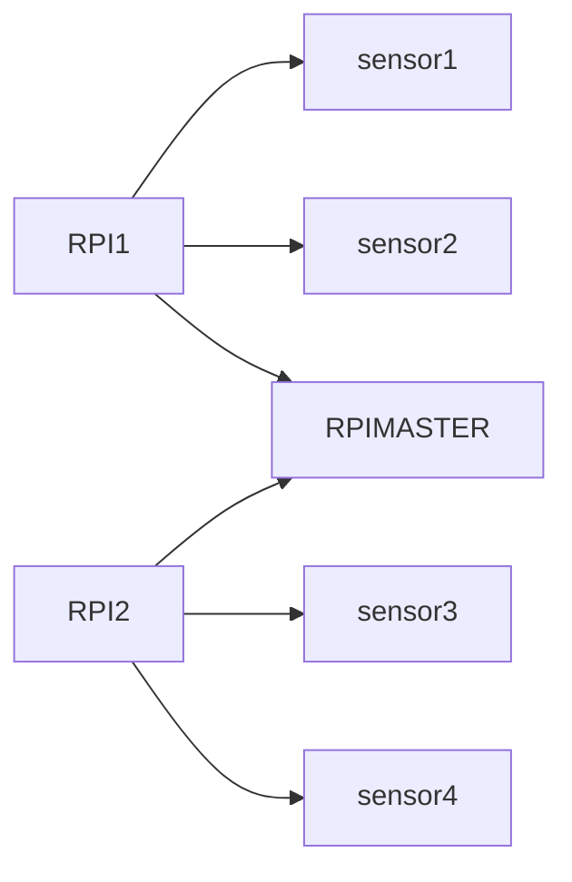

# EGL314_TEAMB
Team B Project LUMEN repository Station 4
-------------------------------
Hello! We are Team B and we are creating a game for our school project "L.U.M.E.N"
Project L.U.M.E.N is an experiential / exploratory initiative that invites you to re-awaken the “Temple of Lumen” using modern audio visual technology.

# Team members

1. Tim
   #Team Leader
2. Priscilla
3. Phyllis
4. Marcus

# Flowchart

